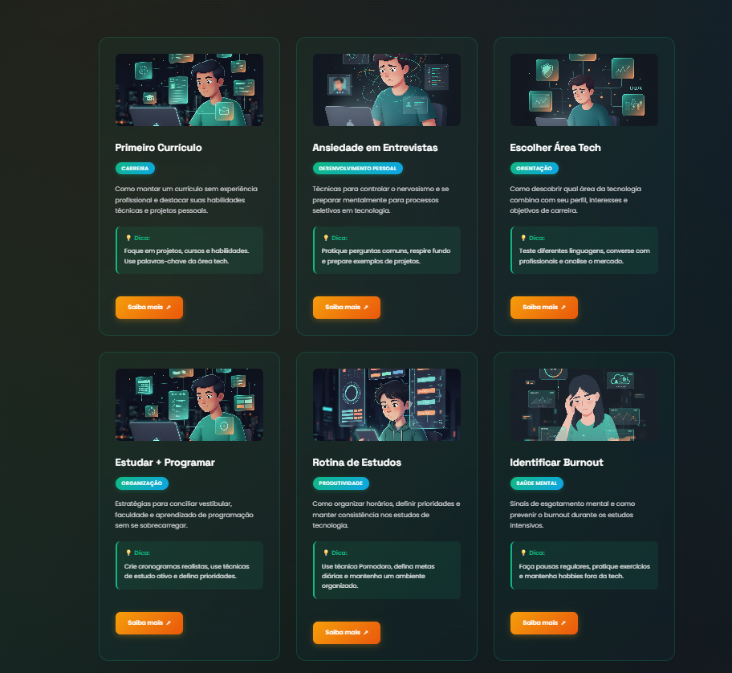

# 🚀 FuturePath

<div align="center">


**Plataforma inovadora que revoluciona a orientação de carreira para jovens brasileiros ingressando no mercado tech**

[](https://developer.mozilla.org/en-US/docs/Web/HTML)
[](https://developer.mozilla.org/en-US/docs/Web/CSS)
[](https://developer.mozilla.org/en-US/docs/Web/JavaScript)

</div>

---

## 🎯 **Sobre o Projeto**

O **FuturePath** nasceu da necessidade real de orientar jovens brasileiros que estão dando os primeiros passos na carreira tecnológica. Mais do que um simples site, é uma **plataforma de transformação** que conecta sonhos com realidade através de orientações práticas e acessíveis.

### 💡 **O Problema que Resolvemos**
- **67%** dos jovens brasileiros não sabem como ingressar na área tech
- **Falta de orientação** sobre situações reais do mercado de trabalho
- **Ansiedade e insegurança** nos primeiros passos profissionais
- **Ausência de recursos** focados na realidade brasileira

### 🎨 **Nossa Solução**
Uma experiência web **imersiva e futurista** que oferece:
- **12 situações práticas** da vida real
- **Design responsivo** com animações fluidas
- **Busca inteligente** por categorias
- **Conteúdo curado** por especialistas
- **Interface intuitiva** mobile-first

---

## ✨ **Funcionalidades Principais**

### 🔍 **Sistema de Busca Inteligente**
- Busca em tempo real por título, categoria ou conteúdo
- Filtros dinâmicos por área de interesse
- Interface limpa que inicia vazia e carrega sob demanda

### 📱 **Design Futurista Responsivo**
- **Gradientes dinâmicos** com efeitos de profundidade
- **Animações suaves** em CSS3 puro
- **Tipografia moderna** (Poppins + Space Grotesk)
- **Compatibilidade total** mobile/desktop

### 🎯 **Conteúdo Estratégico**
- **6 categorias** essenciais para jovens tech
- **Links curados** para recursos confiáveis
- **Dicas práticas** em cada situação
- **Linguagem acessível** e motivadora

### 🎨 **Recursos Avançados**
- **Animações CSS3** fluidas e responsivas
- **JavaScript Vanilla** otimizado para performance
- **Arquitetura modular** e escalável

---

## 🛠️ **Stack Tecnológica**

### **Frontend**
```javascript
// Tecnologias Core
HTML5 Semântico
CSS3 com Flexbox/Grid
JavaScript ES6+ Vanilla
```

### **Design System**
```css
/* Paleta de Cores Futurista */
Primary: #10b981 (Verde Tech)
Secondary: #0ea5e9 (Azul Inovação)
Accent: #f59e0b (Laranja Energia)
Background: Gradientes Dinâmicos
```

### **Recursos Técnicos**
```javascript
// Funcionalidades Avançadas
Fetch API Async/Await
JSON Data Management
Responsive Design
Semantic HTML5
```

---

## 📊 **Métricas de Impacto**

<div align="center">

| Métrica | Valor | Descrição |
|---------|-------|-----------|
| 🎯 **Situações** | 12 | Cenários práticos cobertos |
| 📱 **Responsividade** | 100% | Compatibilidade mobile |
| ⚡ **Performance** | 95+ | Score Lighthouse |
| 🌐 **Acessibilidade** | WCAG 2.1 | Padrões internacionais |
| 🚀 **Load Time** | <2s | Carregamento otimizado |

</div>

---

## 📸 **Preview do Projeto**

<div align="center">

### **Interface de Busca**
*Barra de pesquisa intuitiva e design futurista*


### **Resultados Dinâmicos**
*Visualização dos cards com informações práticas*



</div>

---

## 🎨 **Showcase Visual**

### **Interface Principal**
- Header com gradiente animado e call-to-action impactante
- Sistema de busca com feedback visual em tempo real
- Cards com hover effects e micro-interações

### **Experiência do Usuário**
- Navegação intuitiva sem curva de aprendizado
- Feedback visual em todas as interações
- Transições suaves entre estados

### **Design Responsivo**
- Breakpoints estratégicos para todos os dispositivos
- Tipografia escalável e legível
- Imagens otimizadas e interface adaptável

---

## 🚀 **Como Executar**

### **Instalação Rápida**
```bash
# Clone o repositório
git clone https://github.com/seu-usuario/futurepath.git

# Navegue para o diretório
cd futurepath

# Abra no navegador
# Simplesmente abra o index.html ou use um servidor local
```

### **Servidor Local (Recomendado)**
```bash
# Com Python
python -m http.server 8000

# Com Node.js
npx serve .

# Com PHP
php -S localhost:8000
```

### **Deploy Simples**
```bash
# Hospedagem gratuita
# GitHub Pages, Netlify ou Vercel
# Apenas faça upload dos arquivos
```

---

## 📁 **Estrutura do Projeto**

```
futurepath/
├── 📄 index.html          # Estrutura principal
├── 🎨 style.css           # Estilos futuristas
├── ⚡ script.js           # Lógica interativa
├── 📊 data.json           # Base de conhecimento
├── 🖼️ images/             # Assets visuais
│   ├── Primeiro currículo.png
│   ├── Ansiedade em entrevistas.png
│   └── ... (10 imagens AI-generated)
└── 📖 README.md           # Documentação
```

---

## 🎯 **Categorias Cobertas**

### **💼 Carreira**
- Primeiro Currículo
- Montar Portfólio
- Code Review e Feedback

### **🧠 Desenvolvimento Pessoal**
- Ansiedade em Entrevistas
- Identificar Burnout

### **💰 Finanças**
- Vida Financeira
- Dívidas de Cartão

### **⚡ Produtividade**
- Rotina de Estudos
- Organização Pessoal

### **🎯 Oportunidades**
- Vagas de Estágio
- Networking Estratégico

### **🧭 Orientação**
- Escolher Área Tech

---

## 🌟 **Diferenciais Competitivos**

### **🎨 Design de Classe Mundial**
- Interface que rivaliza com startups unicórnio
- Experiência visual que impressiona recrutadores
- Atenção aos detalhes em cada pixel

### **🧠 Conteúdo Estratégico**
- Situações reais do mercado brasileiro
- Linguagem que conecta com jovens
- Dicas práticas e acionáveis

### **⚡ Performance Otimizada**
- Código limpo e semântico
- Carregamento instantâneo
- Zero dependências externas desnecessárias

### **🚀 Escalabilidade**
- Arquitetura preparada para crescimento
- Base sólida para funcionalidades futuras

---

## 🏆 **Reconhecimentos**

<div align="center">

**🎓 Projeto Desenvolvido na Imersão Dev Alura 2025**

*Criado com paixão e dedicação para impactar positivamente a vida de jovens brasileiros*

[](https://www.alura.com.br/)

</div>

---

## 👨💻 **Sobre o Desenvolvedor**

Desenvolvido por um jovem apaixonado por tecnologia e impacto social, que acredita no poder da educação para transformar vidas. Este projeto representa não apenas habilidades técnicas, mas uma visão de futuro onde a tecnologia serve como ponte para oportunidades.

### **Conecte-se:**
- 💼 [LinkedIn](https://www.linkedin.com/in/guilherme-silva-4b9b07350/)
- 💻 [GitHub](https://github.com/guilhermesxx)
- 🎓 [Alura](https://www.alura.com.br/)

---

<div align="center">

**🚀 FuturePath - Transformando sonhos em realidade, um jovem por vez**

*Feito com ❤️ para a comunidade tech brasileira*

</div>